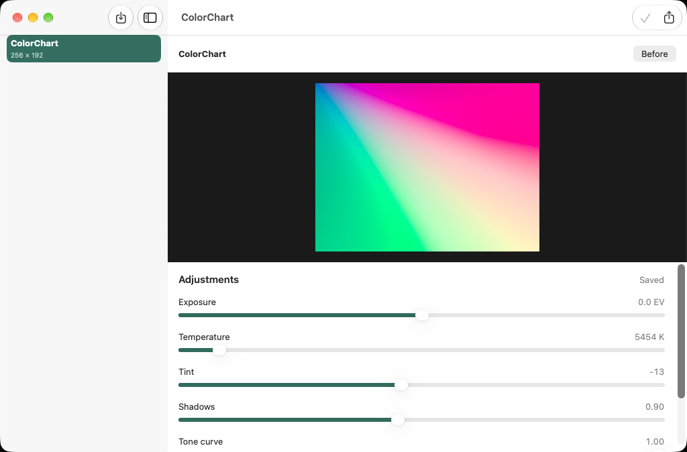

# RAW Photo Studio



A native iPad and Mac workspace for developing camera RAW images without changing the original. Import a supported RAW or DNG, compare the baseline with your adjustments, save a recipe, and export an sRGB JPEG.

## Editing workflow

- A local library of original RAW files with separate, revision-checked JSON adjustment recipes.
- Exposure, white balance temperature/tint, shadow boost, and tone-curve controls backed by `CIRAWFilter`.
- The system's newest supported RAW decoder is chosen on import and recorded with the recipe for repeatable reopening. OS 27 includes RAW 9; support varies by camera and DNG type.
- Debounced previews up to 1,800 pixels, actor-isolated rendering, cancellation, and protection against stale preview results.
- Before/after comparison, reset to the imported baseline, explicit save, and full-resolution JPEG export through the native save interface.

## Run

Open `RAW Photo Studio.xcodeproj` in Xcode 27 and select the **RAW Photo Studio** scheme. Targets: iPadOS 27 and macOS 27. Bundle ID: `com.dd.rawphotostudio`. Mac uses ad-hoc signing; select your own development team to run on a physical iPad.

Use **Import RAW**, make adjustments, then **Save adjustments**. Importing another file is disabled while edits are unsaved; selecting another library item asks before discarding changes. Export captures the selected adjustment values when you press **Export JPEG**, including unsaved edits. Exporting does not save the recipe.

`Tests/Fixtures/ColorChart.dng` is an original synthetic linear DNG for trying the workflow without supplying a personal photograph. Its generator is included. It exercises decoding and export; it does not represent the quality or camera coverage of real sensor RAW files.

## Architecture

`RAWLibrary` owns original-file copying, recipe validation, atomic writes, rendering, and export on an actor. `StudioModel` owns observable main-actor UI state and cancellable preview tasks. Core Image uses its managed rendering backend. No third-party runtime dependencies are required.

Inputs are bounded to 100 MB and 80 megapixels. Recipes validate finite numeric values and safe original-file names. Original bytes remain unchanged. Saved revisions reject stale updates rather than overwriting a newer recipe.

## Verify

```sh
swift test
swift test -c release
bash Scripts/test-ui.sh
```

Core tests cover invalid inputs, adjustment ranges, real DNG decoding, original-byte preservation, saved recipes, revision conflicts, and JPEG export. The hosted native workflow imports the fixture through the open panel, changes exposure, saves, and reopens it. Result bundles retain screenshots.

Regenerate the original fixtures and icon with `python3 Scripts/GenerateFixture.py` and `swift Scripts/GenerateIcon.swift "$PWD"`.

## Limits

JPEG export is 8-bit SDR sRGB, without source metadata. There is no HDR/RAW export, lens-profile editor, crop tool, batch processor, or cloud library. Camera support is provided by macOS/iPadOS; some cameras require additional system decoder resources. A missing decoder produces an error rather than a substitute preview. Confirm color and camera behavior with your own originals before relying on an export.

Recipes are saved explicitly. Unsaved changes are lost when the app exits. Archiving/deletion and cross-device synchronization are outside this version's scope.

[Apple Core Image](https://developer.apple.com/documentation/coreimage) · [Privacy](PRIVACY.md) · [Verification](Docs/Verification.md) · [MIT license](LICENSE)
